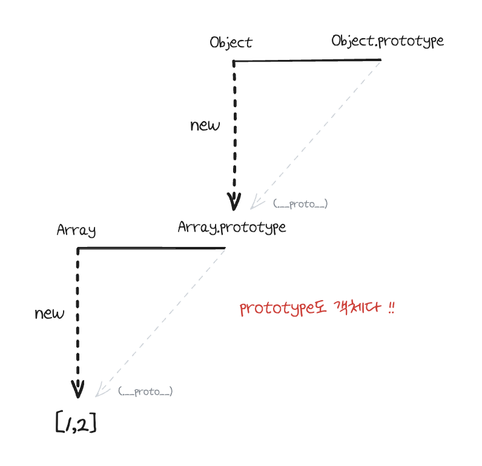
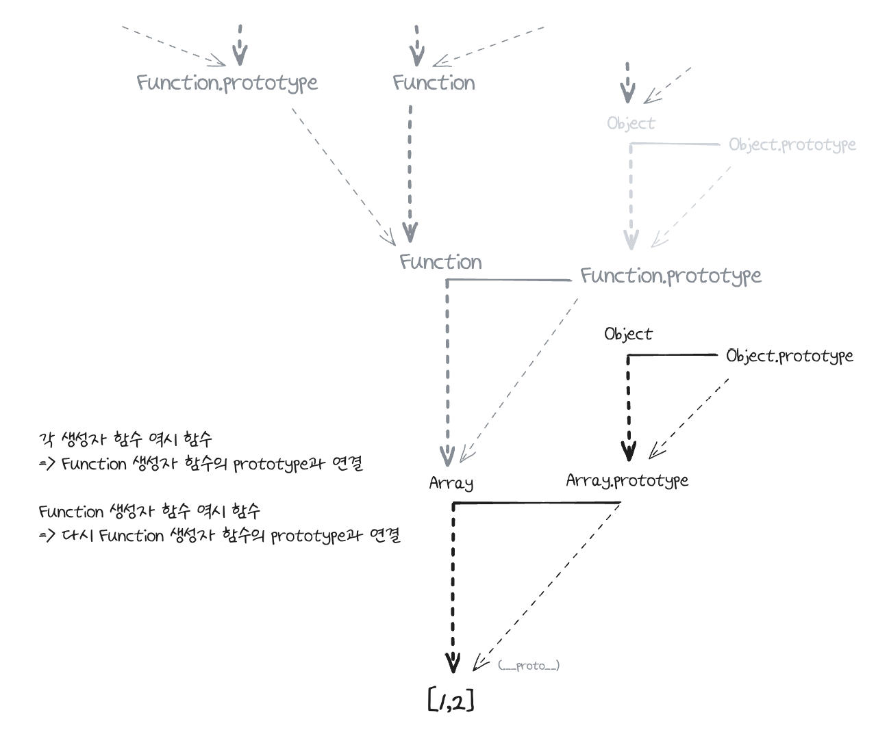
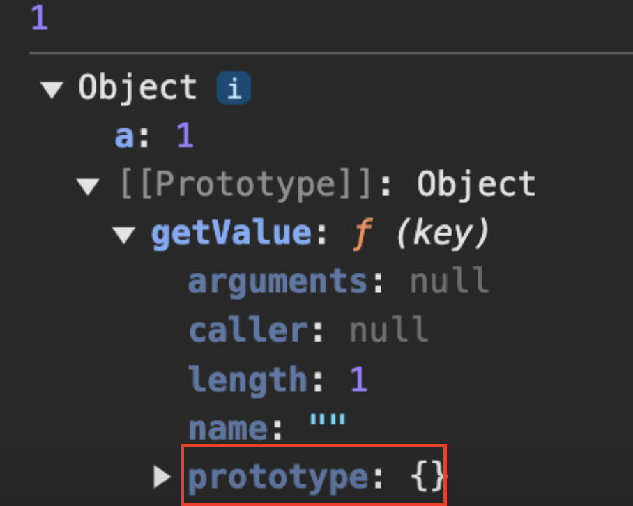
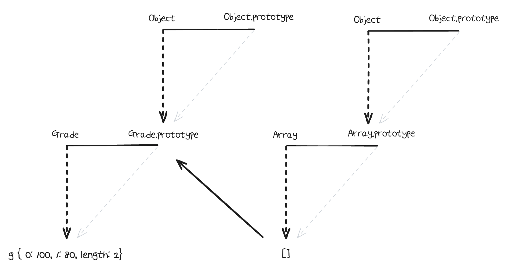
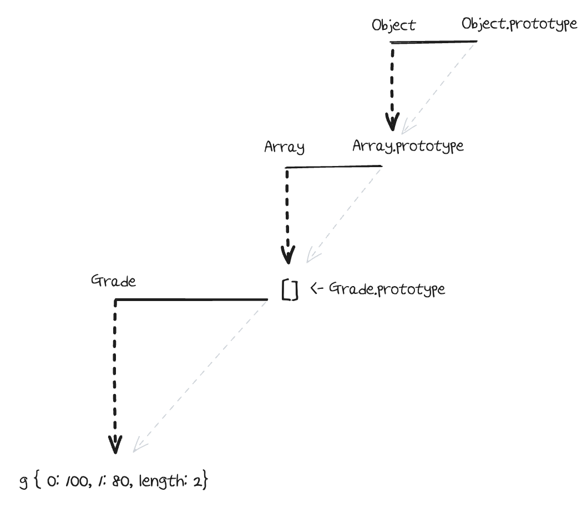

# 1. 프로토타입의 개념 이해

## 1-1. constructor, prototype, instance

## 1-2. constructor 프로퍼티

# 2. 프로토타입 체인

## 2-1. 메서드 오버라이드

## 2-2. 프로토타입 체인





## 2-3. 객체 전용 메서드의 예외사항

모든 생성자 함수의 prototype은 반드시 객체이기 때문에 Object.prototype이 프로토타입 체인의 최상단에 항상 존재

👉 객체에서만 사용할 메서드는 프로토타입 객체 안에 정의할 수 없음

👉 만약 Object.prototype 안에 정의하면 다른 데이터 타입들도 해당 메서드를 사용할 수 있게 되기 때문

**[Object.prototype에 추가한 메서드에의 접근 예시]**

```javascript
Object.prototype.getEntries = function () {
  var res = [];
  for (var prop in this) {
    if (this.hasOwnProperty(prop)) {
      res.push([prop, this[prop]]);
    }
  }
  return res;
};
var data = [
  ["object", { a: 1, b: 2, c: 3 }], // [["a",1],["b",2],["c",3]]
  ["number", 345], // []
  ["string", "abc"], // [["0","a"],["1","b"],["2","c"]]
  ["boolean", false], // []
  ["func", function () {}], // []
  ["array", [1, 2, 3]], // [["0",1],["1",2],["2",3]]
];
data.forEach(function (datum) {
  console.log(datum[1], getEntries());
});
```

이러한 이유로, 객체만을 대상으로 동작하는 객체 전용 메소드들은 부닥이 Object.prototype이 아닌 Object의 <ruby><span>스태틱 메서드</span><rt>static method</rt></ruby>로 부여

👉 생성자 함수인 Obejct와 인스턴스인 객체 리터럴 사이에는 this를 통한 연결이 불가능함. 따라서 다른 메서드들처럼 `메서드명 앞의 대상이 곧 this`가 되는 방식 대신 this의 사용을 포기하고 `대상 인스턴스를 인자로 직접 주입`하는 방식으로 구현

👉 그동안 `Object.freeze(instance)`와 같은 형태로 사용하고 `instance.freeze()`가 불가능한 이유 !!

**[정리]**

객체 한정 메서드들을 `Object.prototype`이 아닌 Object에 직접 부여할 수밖에 없었던 이유는 Obejct.prototype이 여타의 참조형 데이터뿐 아니라 기본형 데이터조차 `__proto__`에 반복 접근함으로써 도달할 수 있는 최상위 존재이기 때문

같은 이유로, `Object.prototype`에는 어떤 데이터에서도 활용할 수 있는 범용적인 메서드들만 존재 (toString, hasOwnProperty, valueOf, isPrototypeOf 등)

**❗[예외]❗**

`Object.create`를 이용한 경우, `Object.prototype`의 메서드에 접근할 수 없는 경우가 있음.
Object.create(null)은 `__proto__`가 없는 객체를 생성함

```javascript
var _proto = Object.create(null); // __proto__ 프로퍼티가 없는 객체
_proto.getValue = function (key) {
  return this[key];
};
var obj = Object.create(_proto);
obj.a = 1;
console.log(obj.getValue("a"));
console.dir(obj);
```



👉 위와 같은 방식으로 만든 객체는 내장 메서드 및 프로퍼티들이 제거됨으로써 기본 기능에 제약이 생긴 대신, 객체 자체의 무게가 가벼워져서 성능 상 이점을 가짐

> [Object.create가 뭔데?](https://developer.mozilla.org/ko/docs/Web/JavaScript/Reference/Global_Objects/Object/create)
>
> 지정된 프로토타입 객체 및 속성(property)을 갖는 새 객체를 생성

## 2-4. 다중 프로토타입 체인

- 자바스크립트의 기본 내장 데이터 타입들은 프로토타입 체인이 1단계(객체)이거나 2단계(나머지)로 끝나는 경우가 있었지만, 사용자가 새롭게 만드는 경우에는 그 이상의 단계도 얼마든지 가능함

- 대각선의 `__proto__`를 이어나가기만 하면 무한대로 체인 관계를 이어나갈 수 있어서 다른 언어의 클래스와 비슷하게 동작하는 구조를 만들 수 있음

**[대각선의 `__proto__`를 연결하는 방법]**
`__proto__`가 가리키는 대상, 즉 생성자 함수의 prototype이 연결하고자 하는 상위 생성자 함수의 인스턴스를 바라보게 하기

```javascript
var Grade = function () {
  var args = Array.prototype.slice.call(arguments);

  for (var i = 0; i < args.length; i++) {
    this[i] = args[i];
  }
  this.length = args.length;
};
var g = new Grade(100, 80);
```

위에서 만들어진 g는 Grade의 인스턴스를 바라보고, Grade의 인스턴스는 여러 개의 인자를 받아 각각 순서대로 인덱싱해서 저장하고 length 프로퍼티가 존재하는 등으로 배열의 형태를 지니지만, 배열의 메서드는 사용할 수 없는 유사배열객체임

여기에서 g가 배열 메서드를 직접 쓸 수 있게 끔 하려면, `g.__proto__`, 즉 `Grade.prototype`이 배열의 인스턴스를 바라보게 만들면 된다.

```javascript
Grade.prototype = [];

// 이후 생성한 인스턴스들은 배열 메소드들 사용 가능
```

이 명령에 의해 서로 별개로 분리돼 있던 데이터가 연결되어 다음과 같이 하나의 프로토 타입 체인 형태를 띠게 된다.

**[연결 전]**


**[연결 후]**


**❓[궁금한 점]❓**
이미 new로 g를 만든 후, Grade의 prototype에 배열 인스턴스를 바라보게 하는 순서여도 g가 배열 메서드를 사용할 수 있을까?

생성 시점이 중요한건지, 아니면 어차피 참초참조이기 때문에 시점은 상관 없는건지..

👉 답: 불가능하다 !!

```javascript
var g = new Grade(3);
Grade.prototype = [];
g.push(3); // 오류

Grade.prototype = [];
var g = new Grade(3);
g.push(3); // 가능
```

> **[프로토타입 자체를 변경하면 나쁜 이유]**
>
> [MDN-상속과 프로토타입#생성자 섹션에서 확인 가능](https://developer.mozilla.org/ko/docs/Web/JavaScript/Inheritance_and_the_prototype_chain#%EC%83%9D%EC%84%B1%EC%9E%90)
>
> 1.  재할당 전에 생성된 인스턴스의 [[Prototype]]은 이제 재할당 후 생성된 인스턴스의 [[Prototype]]과 다른 객체를 참조합니다. 하나의 [[Prototype]]을 변경해도 더 이상 다른 객체가 변경되지 않습니다.
> 2.  constructor 속성을 수동으로 재설정하지 않는 한, instance.contructor에서 더 이상 생성자 함수를 추적할 수 없어 동작 방식을 예상하기 어려워집니다. 일부 기본 제공 연산은 constructor 속성도 읽으며 설정되지 않은 경우, 예상대로 작동하지 않을 수 있습니다.
